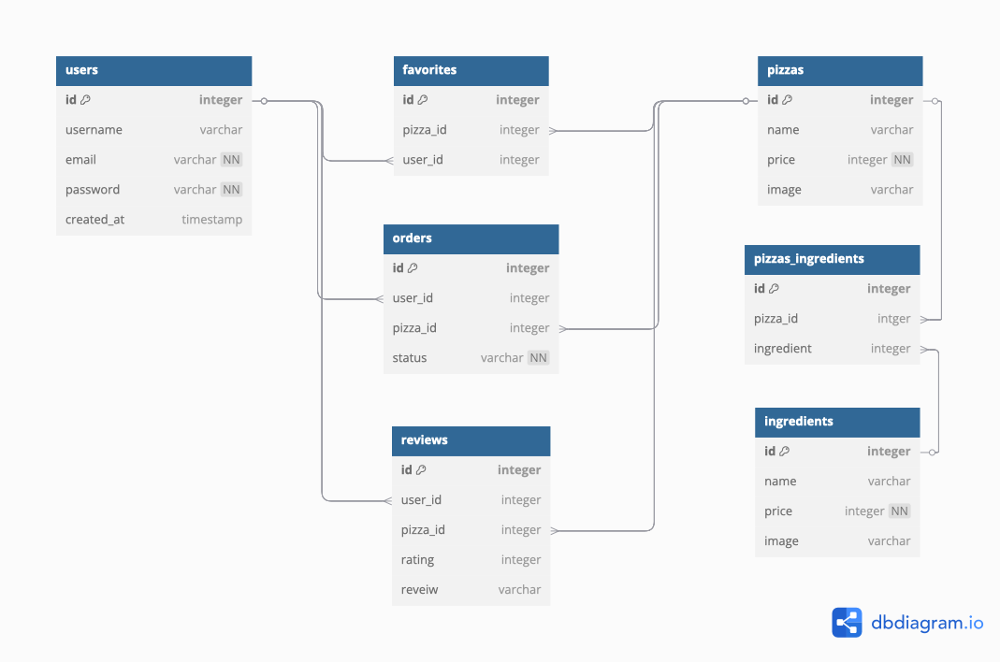

# FronoPizza

Oven Rome is a pizzeria online.

Author: [Ihor Lazarkov](https://ihorlazarkov.github.io/IhorLazarkov/)

## Tech stack

<details open>
    <summary> Tech Stack</summary>
    
</img>

</details>

## Colors

<details>
    <summart>Colors palitra</summary>

    ```
        body{
            --primary-v1: #a6362c;
            --secondary-v1: #6e7f4e;
            --sub-primary-v1: #6c3b2a;
            --sub-secondary-v1: #fdf7f2;
            --third-v1: #333333;
        }
    ```

<span style="background-color:#a6362c; padding:15px; margin-bottom:20px;">#a6362c</span>
<span style="background-color:#6e7f4e; padding:15px; margin-bottom:20px;">#6e7f4e</span>
<span style="background-color:#6c3b2a; padding:15px; margin-bottom:20px;">#6c3b2a</span>
<span style="background-color:#fdf7f2; padding:15px; color:black;  margin-bottom:20px;">#fdf7f2</span>
<span style="background-color:#333333; padding:15px; margin-bottom:20px;">#333333</span>

</details>

## Database

<details>
  <summary>DB schema</summary>



</details>

## API specifications

<details>
    <summary>Add a review</summary>

__Headers__

    URI: /api/review
    Method: POST
    Body: {
        "user_id": Number,
        "pizza_id: Number,
        "rating": Number,
        "review": String
    }

__Response__

    status: 201

    response: 
        {"message":"success"}

</details>

<details>
    <summary>Get all ingredients</summary>

__Headers__

    URI: /api/ingredients
    Method: GET

__Response__

    status: 200

    response: 
    [
        {            
            "name":String,
            "image":String,
            "price":Number
        }
    ]
</details>

<details >
    <summary>Get all favorites</summary>

__Headers__

    URI: /api/session/favorites
    Method: GET

__Response__

    status: 200

    response: 
    [
        {            
            "name":String,
            "image":String
        }
    ]

</details>

<details >
    <summary>Get all favorites</summary>

__Headers__

    URI: /api/session/favorites
    Method: GET

__Response__

    status: 200

    response: 
    [
        {            
            "name":String,
            "image":String
        }
    ]

</details>
